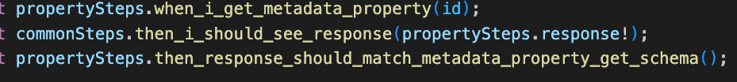
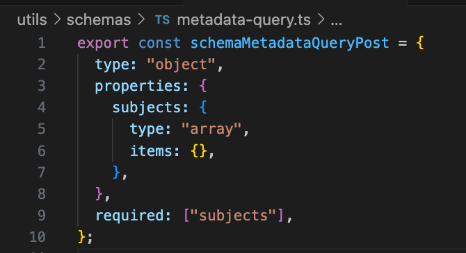
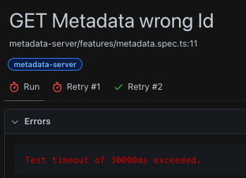
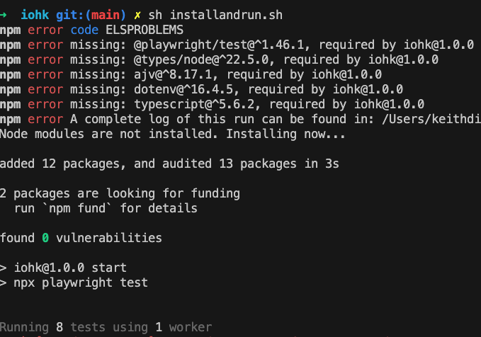
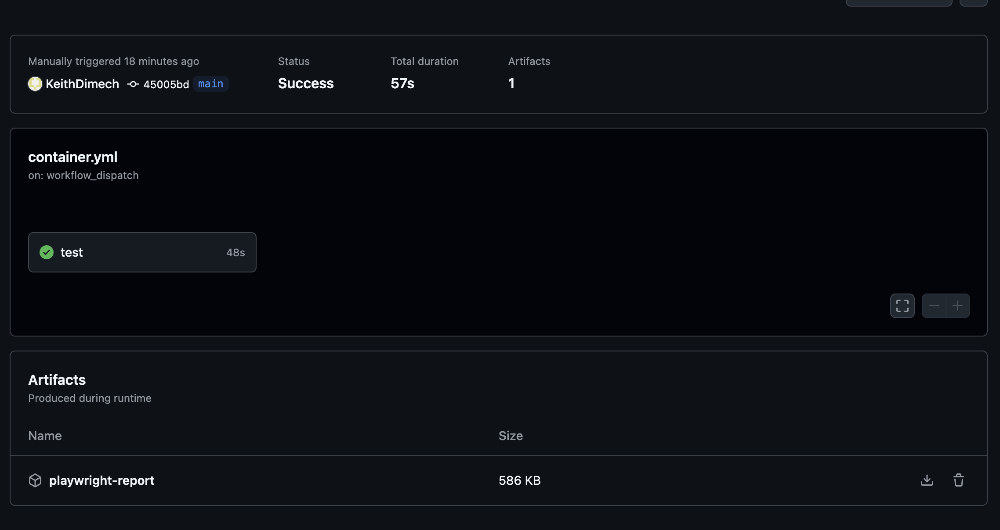
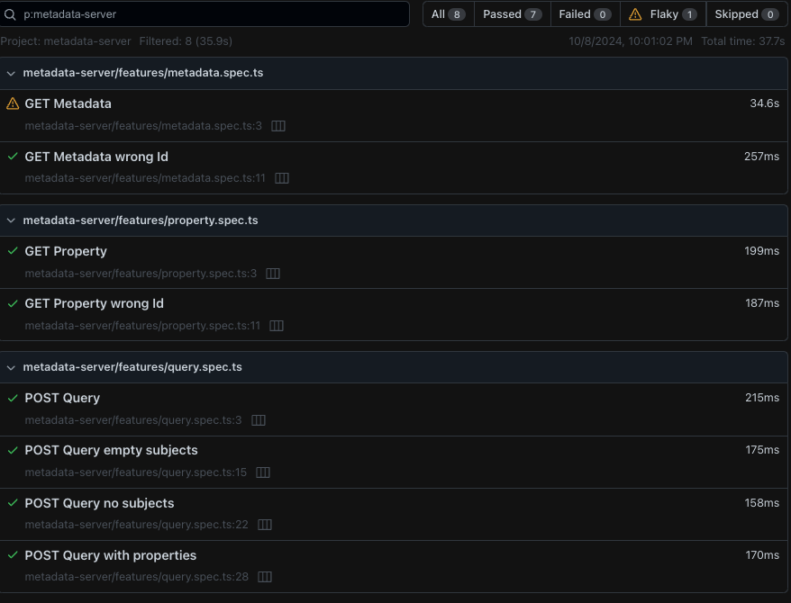

# iohk

This project provides a user-friendly BDD solution for automated API tests using Playwright, a powerful end-to-end testing framework. This was accomplished while retaining Playwright in its vanilla state without adding any Gherkin dependencies.

API testing is also supported with validating responses against predefined schemas. In this way errors are caught early in the development process and maintain API contracts.

Features like Playwright's inbuilt retry mechanism was leveraged to compensate for the service cold start issue.

## Local Installation via Custom script

This Bash script automates the installation process for Playwright, a popular end-to-end testing framework for web applications. It performs the following tasks:

Checks for Node.js: Verifies if Node.js is installed on the system. If not, it provides a message prompting the user to install Node.js.
Installs Playwright globally: If Playwright is not installed globally, it installs it using npm install -g playwright.
Installs project dependencies: If Playwright is not listed as a dependency in the current project, it installs it using npm install playwright.
Installs Node modules: Checks if the node_modules directory exists. If not, it installs Node modules using npm install.
Runs Playwright tests: Executes Playwright tests located in the specified test file (replace your_test_file.js with your actual test file).

Usage:

Make the script executable using chmod +x install-and-run-pw.sh.
Run the script: ./install_and_run_playwright.sh

## CI Pipeline

The pipeline is executed on a schedule in a workflow is making use of a docker image which is developed and maintained by Microsoft. The workflow is constructed as per playwright [GitHub Actions](https://playwright.dev/docs/ci#github-actions).

A Dockerfile is added to check tests and dependencies locally after changing or upgrading.

> docker build -t my-tests .
>
> docker run my-tests

### Github

Pipeline artifacts are uploaded to gitlab after run is complete for investigation and reporting.

## Report

